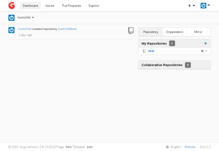
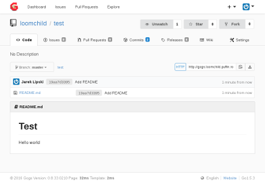

# Gogs
_painless, self-hosted Git service_

https://gogs.io/

Gogs (Go Git Service) is a painless self-hosted Git service. 
The goal of this project is to make the easiest, fastest, and most 
painless way of setting up a self-hosted Git service visually similar 
to GitHub.

 

